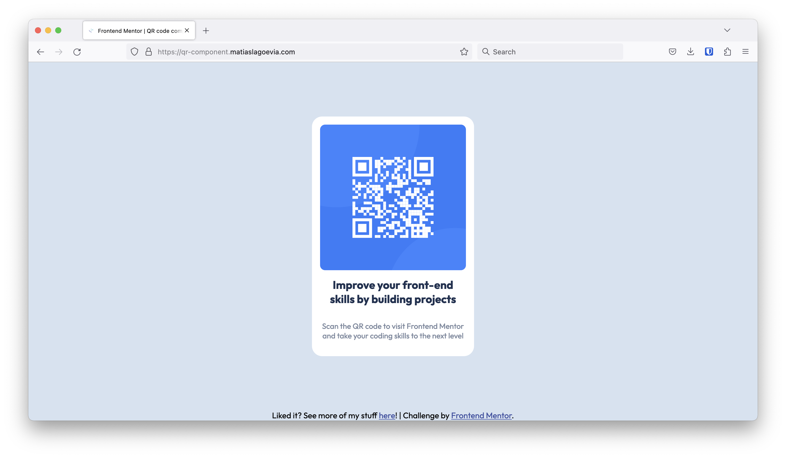

# Frontend Mentor - QR code component solution

This is a solution to the [QR code component challenge on Frontend Mentor](https://www.frontendmentor.io/challenges/qr-code-component-iux_sIO_H). Frontend Mentor challenges help you improve your coding skills by building realistic projects.

## Table of contents

- [Overview](#overview)
  - [Screenshot](#screenshot)
  - [Links](#links)
- [My process](#my-process)
  - [Built with](#built-with)
  - [What I learned](#what-i-learned)
  - [Continued development](#continued-development)
  - [Useful resources](#useful-resources)
- [Author](#author)
- [Acknowledgments](#acknowledgments)

## Overview

### Screenshot

### Links

- Solution URL: [https://www.frontendmentor.io/solutions/qr-component-using-flexbox-OnysNVJv8T](https://www.frontendmentor.io/solutions/qr-component-using-flexbox-OnysNVJv8T)

- Live Site URL: [https://qr-component.matiaslagoevia.me](https://qr-component.matiaslagoevia.me)

## My process

### Built with

- Semantic HTML5 markup
- Flexbox

### What I learned

> **Working from a Figma design spec**

Detailed examination of the reference (sizing, spacing, etc) helped to continue developing my attention to detail. The design's consistency internalizes these concepts for later designs/implementations of my own.

> **Centering the card while having the footer at the bottom of the page**

_TLDR: use `flex: 1` or `flex-grow: 1` as a "take up whatever space you have available" instruction within a flex context._

1. I was able to center the card without the footer.

- For the `body`, I want to..

  - take up all available space in the viewport: `height: 100vh`
  - get rid of any margins: `margin: 0`
  - flex in a vertical direction: `display: flex` and `flex-direction: column`
  - center children in both axes: `align-items: center` and `justify-content: center`

- For a `.card`, I want to..
  - give it a color: `background-color: blue`
  - give it a width and height: `width: 288px` and `aspect-ratio: 288/366`
  - (other styling concerns...)

This works as expected: [see the codepen](https://codepen.io/matiaslagoevia/pen/LYqzpyx).

2. However, when I add a footer it isn't added to the bottom of the screen — it's immediately below the card near the center of the screen. This is expected, because the footer is another child of the body.

- To treat them as separate children, I want to..

  - differentiate content vs footer: `body.main` vs `body.footer`
  - put the card within the content: `body.main.card`

- To only apply centering to the content, I want to..
  - move `align-items: center` and `justify-content: center` from `body` to `main`
  - have `main` flex in a vertical direction: `display: flex` and `flex-direction: column`

This uncovers a new issue: [see the codepen](https://codepen.io/matiaslagoevia/pen/eYxGpPJ).

It's not using all the space available anymore!

- The card is centered horizontally, but not vertically (it is centered vertically, it just has a height exactly equal to the content so there's no vertical space surrounding it)
- The footer comes before all of the other space left, rather than after it

I'd want the footer to be at the bottom of the page, and then have whatever space
would want to set a height on `main` so that the content takes up as much space possible of what's available.

Turns out this is possible with: `flex: 1`, which is equivalent to `flex-grow: 1`, [see the codepen](https://codepen.io/matiaslagoevia/pen/eYxGpPJ). Technical references available [here](#useful-resources).

### Continued development

I see three directions I'd like to grow from here:

1. Take a challenge that addresses responsiveness/different layouts. Something that changes based on what device the user has.
2. Learn about how to use tools for accessibility to experience my interfaces in the same way as users with disabilities would.
3. Continue to learn about flexbox as I take on more challenges. `flex-grow`, `flex-shrink`, and `flex-basis` seem interesting.

### Useful resources

- [MDN - flex](https://developer.mozilla.org/en-US/docs/Web/CSS/flex) — helped me find what the shorthand notation corresponded to
- [MDN - flex-grow](https://developer.mozilla.org/en-US/docs/Web/CSS/flex-grow) — helped me understand more about how my problem of spacing could be solved

## Author

- Website - [matiaslagoevia.me](https://matiaslagoevia.me)
- Frontend Mentor - [@matiaslagoevia](https://www.frontendmentor.io/profile/matiaslagoevia)

## Acknowledgments

Thanks to Frontend Mentor for providing an amazing platform and community!
